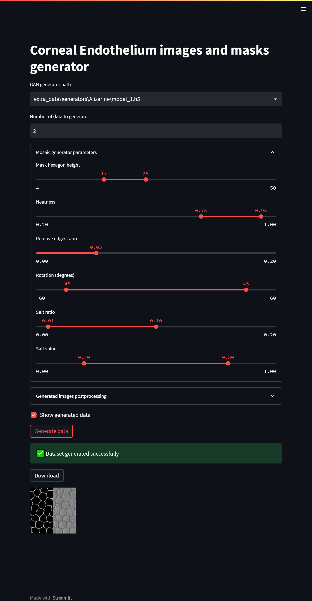

# Corneal endothelium image segmentation using CNN trained with Patch-GAN generated data

Mosaic Generator (`hexgrid.py/grid_create_hexagons`) is based on https://github.com/MichaelMure/gimp-plugins/blob/master/common/mosaic.c

Patch-Based-UNet prediction is based on https://github.com/afabijanska/CornealEndothelium

Repository contains implementation of convolutional neural network models: Patch-GAN and Segmentation Sliding-Window UNet.

## Prerequisites
Code was tested on Windows 10 64-bit with Python 3.10.9, and TensorFlow 2.9.1. Befeore use, run `pip install -r requirements.txt` or `python -m pip install -r requirements.txt`.

## Streamlit App
To run a Streamlit app you can use the command `streamlit run main.py` or `python -m streamlit run main.py` in your terminal or command prompt. Make sure that you have streamlit package installed on your machine before running this command.
If you get `ImportError: cannot import name 'builder' from 'google.protobuf.internal'` run `python -m pip install --upgrade protobuf` or `python -m pip install protobuf==3.20.0`.

You can generate and download a corneal endothelium images dataset with a GUI. You can also use the `gan_patch_generator.ipynb` notebook to do so.

